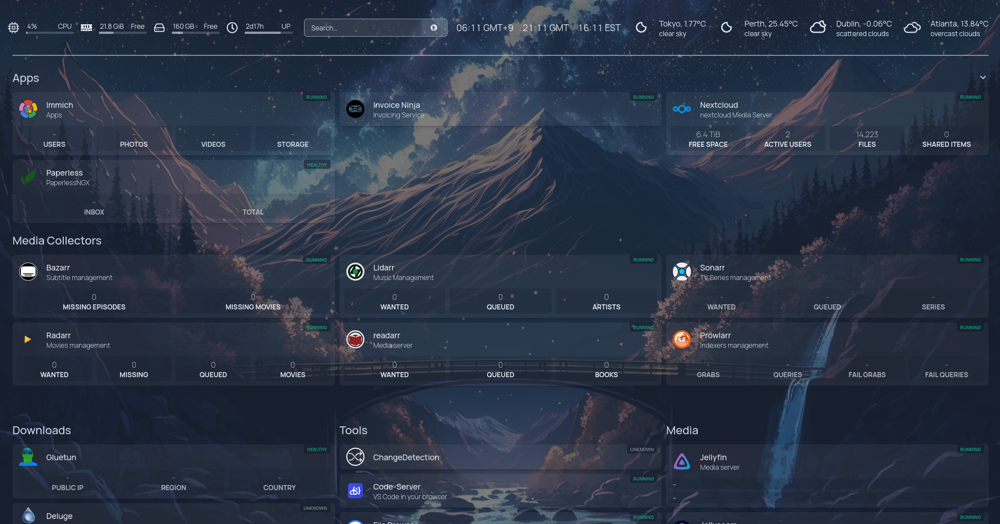

# Compose Yourself 🐳

> *Compose yourself. We already wrote the rest.*

A collection of Docker Compose stacks for self-hosting. Each stack lives in its own folder with a `compose.yml` (or `compose.yaml`) and optional `.env` files. Use as reference or copy what you need.

---

## 📋 Structure & conventions

| Convention | Description |
|------------|-------------|
| **One stack per folder** | e.g. `traefik/`, `nextcloud/`, `download-stack/` |
| **Env** | Stacks expect `.env` in the stack directory (or project root) |
| **`PATH_DATA`** | Persistent data: databases, media, configs |
| **`PATH_CONFIG`** | App config when separate from data |
| **`DEFAULT_DOMAIN`** | Base domain for Traefik `Host()` rules (e.g. `example.com`) |
| **Traefik** | Many stacks use Traefik labels and an external `proxy` network. Run Traefik first if you use it |
| **Compose headers** | Each compose file has a short description and service links at the top |

---

## 🏠 Infrastructure

### 🔐 Identity & auth

| Stack | Description |
|-------|-------------|
| [Authentik](authentik/) | SSO and identity provider (server, worker, PostgreSQL, GeoIP updater) |
| [Zitadel](zitadel/) | Identity and access management (OIDC/OAuth2) |

### 🌐 Core Services, Reverse proxy & ops

| Stack | Description |
|-------|-------------|
| [Traefik](traefik/) | Reverse proxy and TLS termination |
| [Docker Proxy](dockerproxy/) | Restricted Docker socket proxy for tools (e.g. Watchtower) |
| [Dockge](dockge/) | Web UI to run and manage Compose stacks |
| [Watchtower](watchtower/) | Auto-update running containers from new images |
| [Uptime Kuma](uptime-kuma/) | Uptime and status dashboard with alerts |
| [UniFi Network Controller](unifi-network-controller/) | Manage Ubiquiti access points, switches, gateways |
| [Komodo](komodo/) | Peripheral and device management (MongoDB + Komodo services) |
| [DNS Stack](dns-stack/) | PowerDNS (authoritative) and optional AdGuard Home instances |

---

## 📱 Communication & collaboration

| Stack | Description |
|-------|-------------|
| [Mattermost](mattermost/) | Team chat (Slack alternative) |
| [Mumble](mumble/) | Low-latency voice chat |
| [Bookstack](bookstack/) | Wiki and documentation (books, chapters, pages) |
| [Docmost](docmost/) | Team docs and collaboration |
| [Nextcloud](nextcloud/) | Files, calendar, contacts, Talk, OnlyOffice |

---

## 🎮 Media & entertainment

### 🎬 Media servers & photos

| Stack | Description |
|-------|-------------|
| [Jellyfin](jellyfin/) | Media server (movies, TV, music) |
| [Immich](immich/) | Photo and video backup with mobile sync and web gallery |

### 📥 Download stack

Single compose: VPN + *arr stack. All download traffic goes through Gluetun.

**[→ Download Stack](download-stack/)**

| Service | Description |
|---------|-------------|
| [Gluetun](https://github.com/qmcgaw/gluetun) | VPN container; other services use its network for secure egress |
| [Prowlarr](https://wiki.servarr.com/prowlarr) | Indexer manager; syncs trackers and indexers to all *arr apps |
| [Radarr](https://radarr.video/) | Movie collection manager; automates grabbing and organizing |
| [Lidarr](https://lidarr.audio/) | Music collection manager for Usenet and BitTorrent |
| [Sonarr](https://sonarr.tv/) | TV series PVR; monitors RSS and grabs new episodes |
| [Readarr](https://readarr.com/) | Book and audiobook collection manager |
| [Bazarr](https://www.bazarr.media/) | Subtitle manager for Sonarr/Radarr; fetches and manages subs |
| [qBittorrent](https://www.qbittorrent.org/) | BitTorrent client with Web UI; used by *arr apps for downloads |
| [Jellyseerr](https://jellyseerr.dev/) | Request management for Jellyfin/Emby; users request movies and TV |
| [Unpackerr](https://golift.io/unpackerr) | Unpacks archives after *arr imports; integrates with Sonarr/Radarr/Lidarr/Readarr |
| [Pinchflat](https://pinchflat.org/) | YouTube downloader and channel archiver |

### 🎲 Gaming

| Stack | Description |
|-------|-------------|
| [Minecraft](minecraft/) | mc-router, lazymc, game server nodes |
| [Pterodactyl](pterodactyl/) | Panel + Wings for game server hosting |

---

## 🛠️ Productivity & tools

### 🤖 AI

| Stack | Description |
|-------|-------------|
| [Open WebUI](open-webui/) | Web UI for local LLMs (Open WebUI + Ollama) |

### 💻 Dev & notes

| Stack | Description |
|-------|-------------|
| [Code Server](code-server/) | VS Code in the browser |
| [Obsidian LiveSync](obsidian-livesync/) | CouchDB backend for syncing Obsidian vaults |
| [Monica](monica/) | Personal CRM (contacts, relationships, reminders) |

### 📁 Files & docs

| Stack | Description |
|-------|-------------|
| [Filebrowser](filebrowser/) | Web file manager |
| [Paperless-NGX](paperless-ngx/) | Document manager (scan, OCR, tag, search) |

### 💰 Finance & business

| Stack | Description |
|-------|-------------|
| [Actual Budget](actual-budget/) | Budgeting with optional sync |
| [Invoice Ninja](invoice-ninja/) | Invoicing, quotes, expenses, client portal |

---

## 🛡️ Monitoring & utilities

### 📊 Monitoring

| Stack | Description |
|-------|-------------|
| [Scrutiny](scrutiny/) | Disk health (SMART) dashboard |
| [ChangeDetector](changedetector/) | Website change detection and alerts |

### 🏠 Dashboards & notifications

| Stack | Description |
|-------|-------------|
| [Homepage](homepage/) | Single dashboard for all services (widgets, links, status) |
| [Ntfy](ntfy/) | Push notifications (topics, scripts, apps) |

### 🔧 Tools stack

**[→ Tools](tools/)** · IT Tools, Stirling PDF, OpenSpeedTest, Speedtest Tracker

| Service | Description |
|---------|-------------|
| [IT Tools](https://it-tools.tech/) | Collection of dev and IT utilities (encoders, formatters, generators) |
| [Stirling PDF](https://www.stirlingpdf.com/) | PDF toolkit in the browser: merge, split, convert, OCR |
| [OpenSpeedTest](https://openspeedtest.com/) | Self-hosted internet speed test |
| [Speedtest Tracker](https://speedtesttracker.io/) | Log and track speedtest results over time |

---

## ⚠️ Disclaimer

These stacks are maintained for my own use and shared as reference. Your environment will differ. Adapt paths, domains, and secrets to your setup and security needs.

**Happy self-hosting.** 🚀
